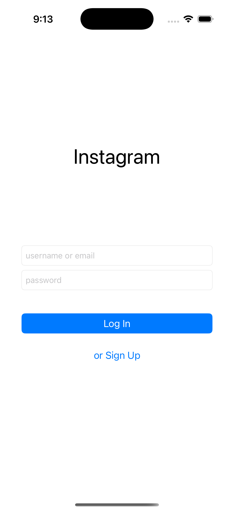
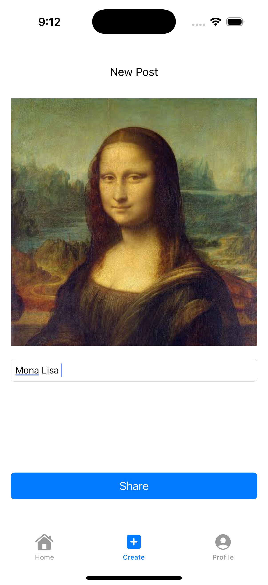
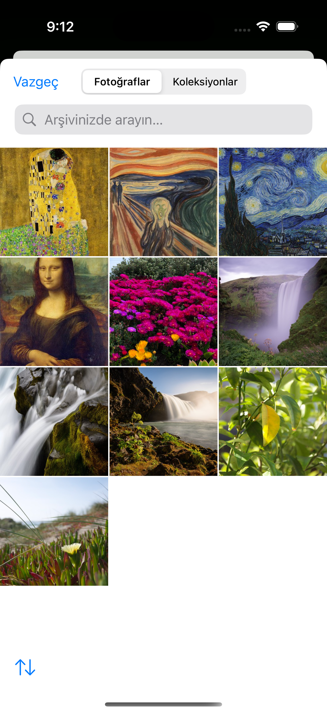
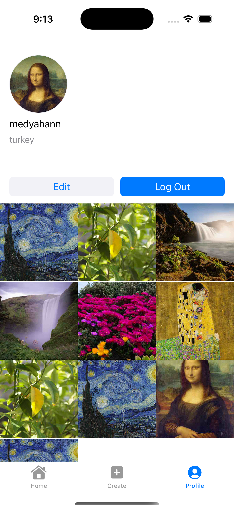
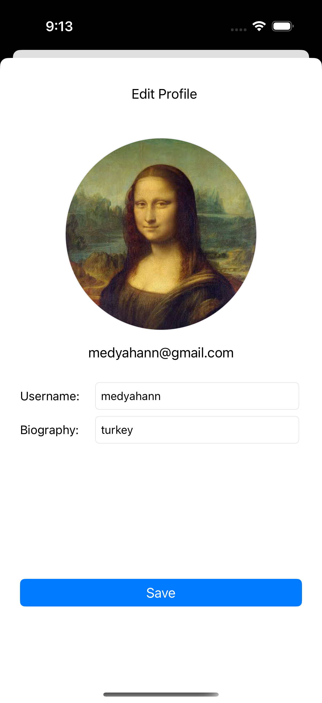

# BaseInstagramCloneApp

**BaseInstagramCloneApp** is a sample Instagram-like iOS application built with **Swift**, **UIKit**, and **Firebase**. The app demonstrates essential features such as user authentication, profile management, photo posting, liking posts, and viewing a user's post collection in a grid format.

---

## Features

### 1. User Authentication

- **Sign Up and Login**
  - Users can create new accounts or log in with existing credentials.
  - Utilizes **Firebase Authentication** for secure user management.
- **Session Management**
  - Persistent user sessions with the ability to log out.
  - Error handling for authentication failures.

### 2. User Profile

- **Profile Viewing and Editing**
  - Users can view their profile details, including username, bio, and profile picture.
  - Edit profile feature allows updating the username, bio, and profile image.
- **Profile Image Handling**
  - Circular profile image display.
  - Default placeholder image for users without a profile picture.
  - Image caching using **SDWebImage** for performance optimization.

### 3. Post Management

- **Create Posts**
  - Users can upload images with descriptions.
  - Images are stored in **Firebase Storage**.
  - Post data is saved in **Firestore**, including image URL, description, and metadata.
- **View Posts**
  - Displays posts in a grid layout on the user's profile page.
  - Dynamic resizing of grid cells to adapt to different screen sizes.
- **Like and Unlike Posts**
  - Users can like or unlike posts.
  - Double-tap gesture on post images to like with an animated heart effect.
  - Real-time like count updates using Firestore listeners.
  - Prevents users from liking a post multiple times.

### 4. Dynamic User Interface

- **Responsive Design**
  - Adapts to various iPhone screen sizes, including small and large devices.
- **Animations**
  - Smooth animations for liking posts.
  - Visual feedback for user interactions.

### 5. Real-Time Updates

- **Firestore Listeners**
  - Real-time synchronization of posts, likes, and profile updates.
  - Automatic UI updates when data changes in Firestore.

---

## Requirements

- **iOS Version:** 14.0 or later
- **Xcode Version:** 12.0 or later
- **Dependencies:**
  - [CocoaPods](https://cocoapods.org/) for managing external libraries
  - **Firebase SDK**
  - **SDWebImage**

---

## Screenshots

### Login / Sign Up Screen

    

### Home Screen

    

### Create Post Screens

    
    

### Profile Screen

    

### Profile Edit Screen

    

